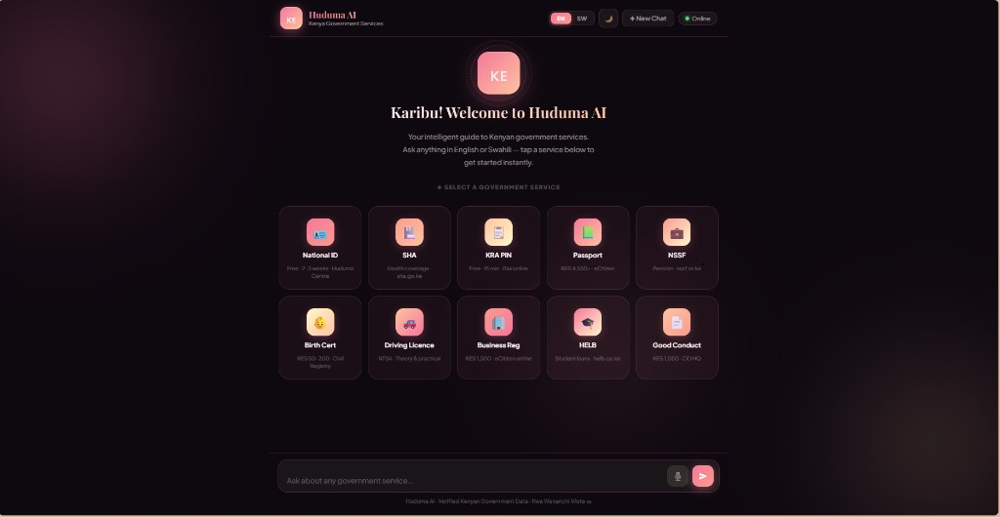

# Huduma AI — AI assistant for Kenyan government services

[](https://vercel.com)

-FF4B4B)
[](#license)
[](https://github.com/Netz1-blip)

## Overview

**Huduma AI** is a bilingual (English + Kenyan Swahili) question‑answering assistant that provides **structured, step‑by‑step guidance** for a curated set of high-demand Kenyan government services (eCitizen/agency workflows).

It’s designed for organizations that spend time answering repetitive “how do I…?” questions—especially Kenyan **Saccos, NGOs, real estate agencies, and businesses**—where customer support teams need **fast, consistent answers** that are grounded in approved information.

Huduma AI solves three problems:
- **Time**: Reduces back-and-forth on requirements, fees, timelines, and where to apply.
- **Consistency**: Standardizes responses across staff and channels (web chat).
- **Clarity**: Turns long policy pages into a clear structure: *What you need → Steps → Cost → Time → Where to apply*.

## Why I built this

Every day Kenyans waste hours queuing at Huduma centres or navigating confusing government websites just to answer simple questions — what documents do I need, how much does it cost, where do I go. I built Huduma AI to give instant, clear, grounded answers to those questions. For citizens directly, and for organizations whose members ask the same questions every day.

## Preview


## Key Features

- **Curated knowledge base**: Service guidance stored as Markdown files under `huduma-ai/services/`.
- **Strict grounding (“KB-only”)**: The assistant is instructed to answer **only** from the injected “OFFICIAL INFORMATION” section for a matched service.
- **Off-topic rejection**: If a question doesn’t match any supported service (and isn’t a greeting), the API returns a safe refusal without calling the LLM.
- **Conversation-aware follow-ups**: If the current message is vague, the API also considers recent history to infer service context.
- **Bilingual UX**: English/Swahili support in UI and response behavior.
- **Fast, serverless delivery**: Runs as a Vercel Serverless Function with a static frontend.
- **Voice input (browser support)**: Optional speech-to-text via the Web Speech API when available.

## How It Works (Technical Flow)

Huduma AI uses a **lightweight, deterministic retrieval gate** (keyword routing), then generates responses with an LLM using **only the selected service content**.

1. **User asks a question** in the web UI.
2. **Service match**: the API scores the message (and recent history) against a keyword index in `services/index.json`.
3. **Retrieve official info**: if matched, the API loads the corresponding Markdown file from `services/` and injects it as `OFFICIAL INFORMATION`.
4. **LLM response**: the API calls Groq’s OpenAI-compatible chat endpoint and returns a structured answer.
5. **Safety gate**: if no service matches, the API returns an on-scope refusal without calling the LLM.

> Note: The current implementation uses **keyword routing**, not vector embeddings. A vector/pgvector upgrade is in the roadmap.

## Target Clients

- **Saccos**: member support on KRA PIN, SHA, IDs, Good Conduct, and onboarding documentation.
- **NGOs & social programs**: frontline staff guidance on citizen documentation pathways and referrals.
- **Real estate agencies**: tenant/buyer documentation workflows (ID, KRA PIN, Good Conduct, business registration).
- **Kenyan businesses (SMEs → enterprise)**: HR/admin support, onboarding checklists, employee documentation guidance.
- **Enterprise & institutions**: contact-center deflection and standardized scripts for citizen support.

## Tech Stack

- **Vercel (hosting + serverless)**: Deploys the static frontend and the `api/` serverless function.
- **Node.js (serverless runtime)**: Executes `huduma-ai/api/chat.js`.
- **Groq API (LLM inference)**: OpenAI-compatible `chat.completions` endpoint used to generate final answers.
- **Vanilla HTML/CSS/JavaScript**: Single-page UI in `huduma-ai/index.html`.
- **Web Speech API (optional)**: Browser speech recognition for voice input (when supported).
- **Markdown knowledge base**: Service documents stored as `.md` files and injected into the model context.
- **JSON service index**: `huduma-ai/services/index.json` defines services, filenames, and keywords for routing.

## Project Structure

The working application lives in `huduma-ai/`.

```
.
├─ README.md
└─ huduma-ai/
   ├─ api/
   │  └─ chat.js                  # Serverless API: keyword routing + KB injection + Groq call
   ├─ services/
   │  ├─ index.json               # Service list + keyword map
   │  ├─ Service-01-National -ID.md
   │  ├─ Service-02-SHA.md
   │  ├─ Service-03-KRA Pin.md
   │  ├─ Service-04-Passport.md
   │  ├─ Service-05-NSSF.md
   │  ├─ Service-06-Birth Certificate.md
   │  ├─ Service-07-DrivingLicense.md
   │  ├─ Service-08-Business Registration.md
   │  ├─ Service -09-HELB.md
   │  └─ Service-Good Conduct.md
   ├─ index.html                  # Client UI (chat, quick service cards, markdown rendering)
   ├─ vercel.json                 # Vercel config (includes services/** in function bundle)
   ├─ .gitignore                  # Ignores .vercel and .env*.local
   └─ .env.local                  # Local env (do not commit)
```

## Setup & Installation

### 1) Clone the repository

```bash
git clone https://github.com/Netz1-blip/Portfolio.git
cd Portfolio
```

### 2) Install Vercel CLI

```bash
npm i -g vercel
```

### 3) Configure environment variables

Create `huduma-ai/.env.local` with at least the required keys below (or set them via Vercel Project Settings).

### 4) Run locally

From the repo root:

```bash
cd huduma-ai
vercel dev
```

Then open the local URL printed by Vercel (typically `http://localhost:3000`) and use the chat UI.

## Environment Variables

> Do **not** commit `.env.local`. This project’s `.gitignore` already excludes `.env*.local`.

| Key | Required | Where | Description |
|---|---:|---|---|
| `GROQ_API_KEY` | Yes | Server (Vercel env / `.env.local`) | API key used by `api/chat.js` to call Groq’s chat completions endpoint. |

## API Endpoints

### `POST /api/chat`

- **Description**: Returns a grounded chat response. Routes the question to a supported service via keyword scoring; injects the relevant `services/*.md` content; calls Groq; returns `{"reply": "..."}`.
- **Request body**:
  - `message` (string, required)
  - `history` (array, optional): `[{ role: "user"|"assistant", content: string }, ...]` (the API uses up to the last 16 entries)
- **Response**:
  - `200 OK`: `{ "reply": "..." }` (also used for off-topic refusals and fallbacks)
  - `400 Bad Request`: `{ "error": "Missing message in request body" }`
  - `405 Method Not Allowed`: `{ "error": "Only POST requests allowed" }`

### `OPTIONS /api/chat`

- **Description**: CORS preflight support.

## Deployment

Huduma AI is structured for **Vercel**:

- `huduma-ai/index.html` is served as the frontend.
- `huduma-ai/api/chat.js` runs as a Vercel Serverless Function.
- `huduma-ai/vercel.json` ensures `services/**` is included in the function bundle so the API can load the Markdown knowledge base at runtime.

Typical deployment steps:

```bash
cd huduma-ai
vercel
```

For production:

```bash
vercel --prod
```

## Roadmap

- **Embeddings + vector search**: Replace keyword routing with semantic retrieval (e.g., Supabase + pgvector) for robust matching and chunk-level grounding.
- **Admin knowledge upload panel**: Secure UI for adding/updating service content without redeploying.
- **Multi-organization support**: Separate knowledge bases per Sacco/NGO/business, with tenant isolation.
- **Audit & reporting**: Answer logs (with redaction), analytics on top questions, and coverage gaps in the KB.
- **Policy update workflow**: Change approvals, versioning, and a “source URL” validation pass per service update.

## License

MIT License — Copyright (c) 2026 Neithen Netz

---
<p align="center">Built in Nairobi 🇰🇪 by <a href="https://github.com/Netz1-blip">Neithen Netz</a></p>

